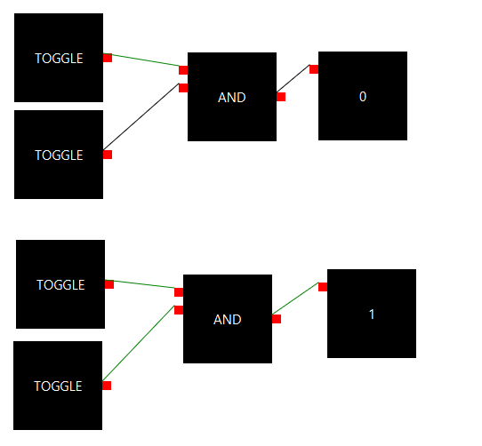
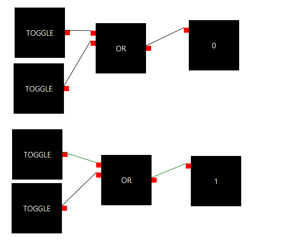
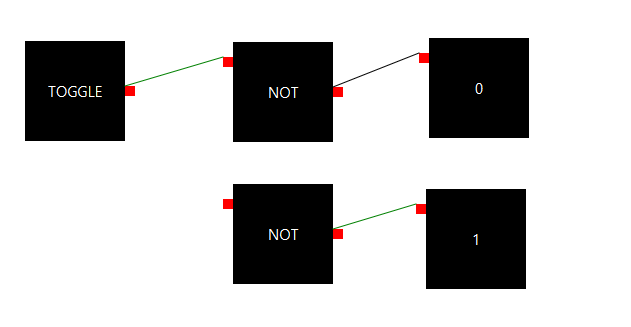

# Circuit-Simulator
Circuit Simulator is a JavaFx program used to simulate the behavior of 
basic logic gates, such as AND and OR gates. Virtually
all computers are comprised of these basic logic gates---by interacting
with this demo, you can learn
more about how computers work at a fundamental level.

## Demo
Watch this awesome 2-minute [video demo](https://vimeo.com/606165828) of the program,
or check out the example slides below!
### AND Gate
The AND Gate only outputs true (1) when both inputs are true. You can tell if an input is true because the color
of the incoming wire will be green.

### OR Gate
The OR Gate will output true when either (or both) inputs are true.

### NOT Gate
The NOT Gate will output true when the input is false, and false when the input
is true. In other words, it will negate the input.

### Note: Broken Build
This particular build appears to be broken. I have not worked on this project for years and only just got around to 
adding it to a remote VCS, so forgive me. Still, you can check out the included images and demo to see what the program
aims to do.

